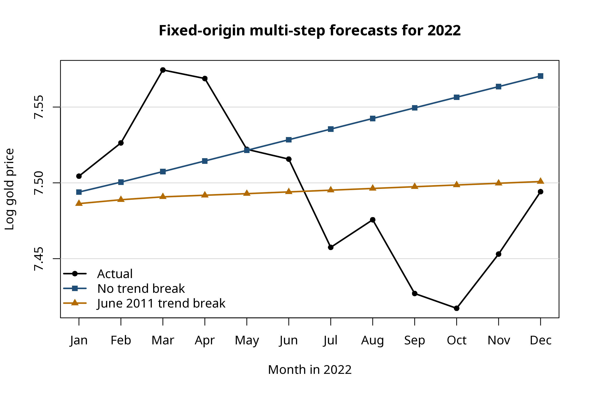

# Gold Price Time-Series Forecasting in R

A time-series forecasting project analysing monthly gold prices from January 2000 to December 2022 using R. The project examines unit-root behaviour, structural change, and out-of-sample forecasting performance.

## Project Objective

The objective is to investigate whether accounting for a structural change in gold-price dynamics can improve forecasting performance.

The estimation sample covers January 2000 to December 2021, while observations from January to December 2022 are reserved for out-of-sample forecast evaluation.

## Methods

The analysis includes:

- Log transformation of monthly gold prices
- Augmented Dickey-Fuller (ADF) unit-root testing
- Linear trend modelling
- Continuous trend-break modelling with a June 2011 break
- Simulation of the trend-break ADF null distribution
- ARIMA-based modelling of first differences
- Fixed-origin 12-step-ahead forecasting
- Out-of-sample forecast evaluation using RMSE

## Results

Both unit-root specifications fail to reject the unit-root null, motivating the use of first differences of log gold prices for forecasting.

The two forecasting specifications produced the following RMSE values for the 2022 holdout sample:

| Model | RMSE |
|---|---:|
| No-break model | 0.0771 |
| June 2011 trend-break model | 0.0514 |

The trend-break model reduced RMSE by approximately **33.4%** relative to the no-break specification in the 2022 holdout sample.

## Forecast Comparison

## Repository Contents

- `gold_price_forecasting.R` — complete R analysis and forecasting code
- `forecast_results.csv` — monthly actual values, forecasts and forecast errors for 2022
- `rmse_summary.csv` — RMSE comparison between forecasting models
- `forecast_comparison.png` — visual comparison of actual and forecast values

## Tools and Skills

**R · Time-Series Analysis · ARIMA · Econometrics · Unit-Root Testing · Structural Breaks · Forecasting · Data Visualisation · Model Evaluation**

## Reproducibility

The analysis was conducted in R using the `forecast` and `urca` packages.

The original dataset is not included in this public repository because redistribution permission has not been established. The R script requires a `GoldPrice.csv` dataset containing the variables `Year`, `Month`, and `GoldPrice`.
